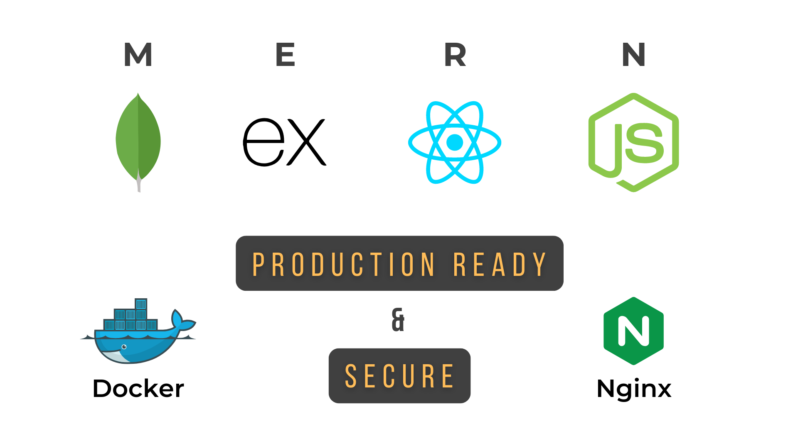
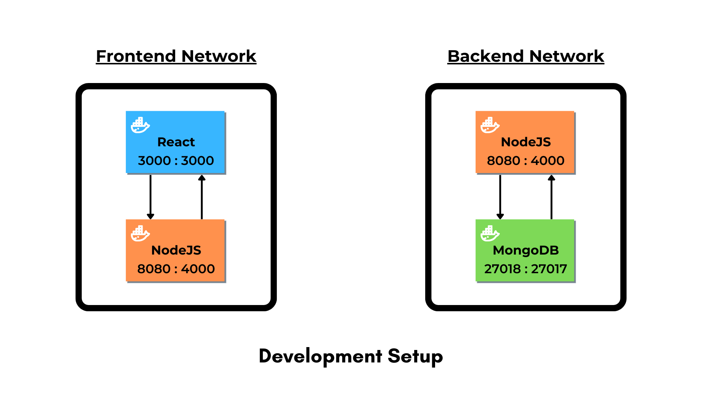
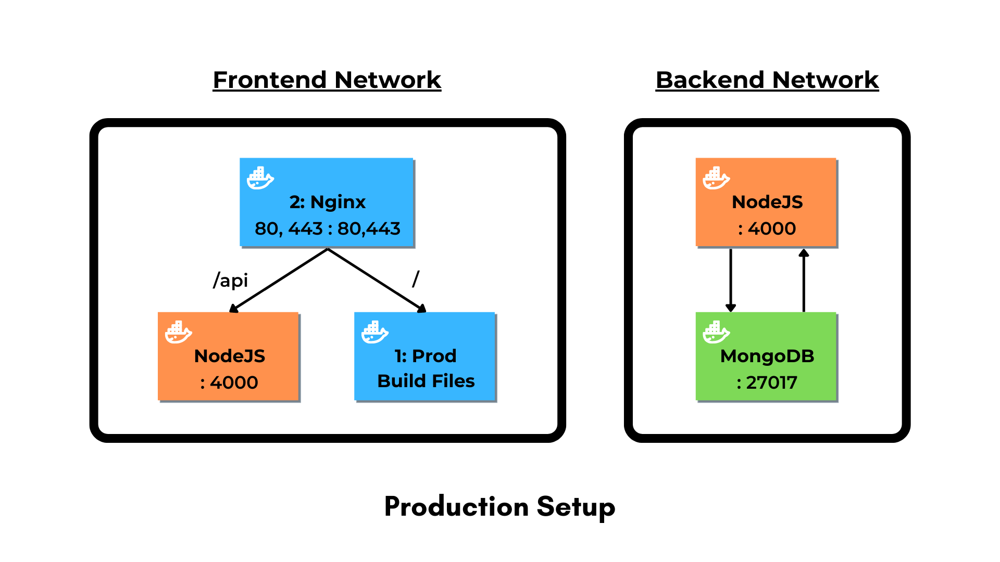

<p align="center">
  
</p>

A production ready & secure boilerplate for the MERN Stack that uses Docker & Nginx.

- **Focus on the product and not the setup**. You can directly start working on your idea and not worry about the nitty gritty setup.
- Most useful libraries already installed so you don't have to run those same npm commands and configure the same thing again and again.
- Optimized for Production out of the box with security kept in mind.
- Ready for local development! You just need to install two requirements!

### Requirements
1. Docker - [Install](https://docs.docker.com/engine/install/)
2. NodeJS - [Install](https://nodejs.org/en/download/)

### Technologies Used
- React (v18)
- Node (v16)
- Express (v4)
- MongoDB (latest)
- Nginx (v1.23.0)
- Docker (v20.10.7)

### Folder Structure
```project-root/ 
  ├── backend/
  │   ├── docker-setup/
  │   └── ...
  └── frontend/     
  │   ├── docker-setup/     
  │   └── ...
  ├── docker-compose.yml
  ├── docker-compose.production.yml
```

## Features
### Security
1. [Bcrypt](https://www.npmjs.com/package/bcrypt) is used for storing hashed passwords.
2. [Passport-JWT](https://www.npmjs.com/package/passport-jwt) is used for session management.
3. The [Helmet](https://www.npmjs.com/package/helmet) library is used for adding the security headers to every request.
4. [Winston](https://www.npmjs.com/package/winston) is used for logging the incoming request information and errors inside request handlers. The log files are `compressed` and are `rotated` every 14 days.
5. [Express-Rate-Limiter](https://www.npmjs.com/package/express-rate-limit) is used for limitimg the number of requests in a particular timeframe to avoid any DOS based attacks.
6. The [Joi](https://www.npmjs.com/package/joi) library is used for checking and validating the params for any given Express request.
7.  Has [auditjs](https://www.npmjs.com/package/auditjs) installed as a dev dependency. Run the `npm run scan` command to check for any vulnerabilities in the packages installed in the Backend.
8. Only the Backend (NodeJS) container has access to the Database (MongoDB) container.
9. The production Dockerfiles have a non-root user created with specific permissions assigned to it.

### Architecture
1. Mounted volumes for both Frontend and the Backend for ease of development.
2. Seperate & Optimized Docker files for Development and Production.

### Backend
1. Environment files have been setup separately for development and production using [Dotenv](https://www.npmjs.com/package/dotenv).
2. [Mongoose](https://www.npmjs.com/package/mongoose) is used as an object modelling framework for MongoDB.
3. [Nodemon](https://www.npmjs.com/package/nodemon) is used to serve the Node application on the local environment for automatic reloading.
4. Docker setup folder structure:
```
docker-setup/
├── mongo/
│   ├── mongo-volume
│   └── db-init.js
└── nodejs/
    ├── development/
    │   └── Dockerfile
    └── production/
        └── Dockerfile
```

### Frontend
1. Bootstrap used as the CSS library.
2. SCSS compatible.
3. React-Router enabled.
4. Font-Awesome used as the Icon library.
5. Axios enabled and configured as an custom interceptor that can send requests with a JWT token.
6. React-Tostify used for showing success / error messages.
7. Docker setup folder structure:
```
docker-setup/
├── nginx/
│   ├── .conf
└── react/
    ├── development/
    │   └── Dockerfile
    └── production/
        └── Dockerfile
```

## Local Development
<p align="center">
  
</p>

- Every container has a **external port** that can be used for communicating with them externally.
- Any changes made to the codebase will automatically be reflected since the **volumes are mounted**.

1. Run the following command in both `frontend` & `backend` directories:
```bash
npm install
```
2. Run the `docker compose` command:
```bash
docker compose up -d
```

2. Check whether the 3 containers are running:
```
docker container ls
```

3. The Backend APIs can be triggered by hitting the following URL:
```
http://localhost:5000
```

4. The Frontend will be served on:
```
http://localhost:3000
```

5. To connect any database UI software with the MongoDB container, use the following details:
```
Host: localhost
Port: 27018
Database Name: mern_docker_starter
Database User: local_user
Database Password: Password123
```

## Production Setup
<p align="center">
  
</p>
  
- All the containers only have a internal port except the Frontend container which has ports `80` and `443` exposed.
- The Frontend container is a `multi-stage` container that builds the production react build files first and then serves them using Nginx.
- Nginx is responsible for `proxying` the requests based on the URL to either to the Frontend or the Backend containers.

On your production setup, follow the steps given below to run the docker containers.

1. Change the environment variables in the `.env.production` file and accordingly change the database variables in the `docker-compose.production.yml` file.

2. Change the `localhost` mentioned as server in the `frontend/docker-setup/nginx/mern-template.conf` file to the domain you want. Example:
```
server_name example.com www.example.com;
```

3. Run the `docker compose` command with the production compose file:
```bash
docker compose -f ./docker-compose.production.yml up -d
```

The frontend container will be exposed on ports `80` and `443` for HTTPs.

It also has `Certbot` installed on it, so you can create your free SSL certificate by following the next steps:

4. Access the frontend container's CLI
```bash
docker exec -it <frontend-container-name> bash
```

5. Generate the SSL certificate using Certbot
```bash
certbot --nginx -d www.example.com -d example.com
```

You are all set! You should be able to access your site through your domain.
